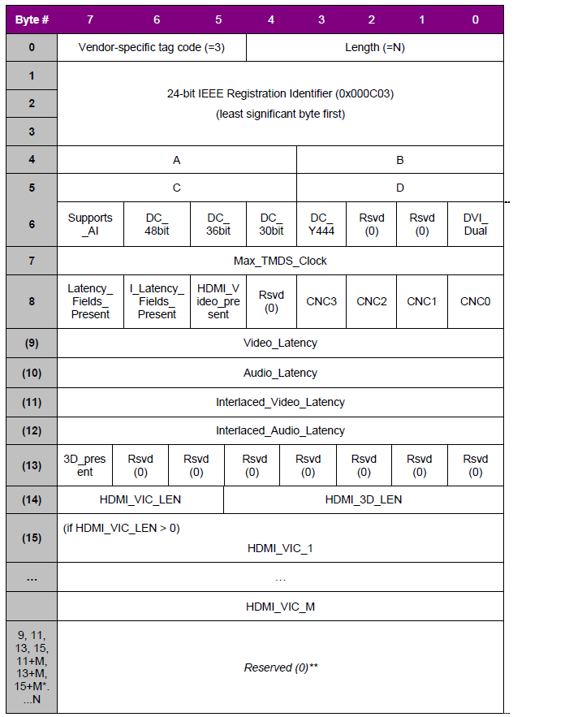

## HDMI EDID解读

### 1. EDID概念
	通常每个HDMI接口都保留有一份256bytes大小的EDID数据，在外接设备HDMI热插拔的时候就会通过HDMI的DDC通道来读取EDID数据。
	EDID里面主要是定义了这显示设备所支持的图像分辨率，支持的声音格式，声音通道,3D,以及所支持的timing等等。
	EDID包含两个部分，基本的EDID只有128个字节，还有128字节的扩展EDID，扩展部分不是必须有的。
### 2. EDIDEDID基本定义：
	(00H-07H)这8个字节是固定的，其必须等于0x00FFFFFFFFFFFFFF00;
	(08H-08H)生产商的ID或者名字;
	(0AH-0BH)产品ID;
	(0CH-0FH)序列号;
	(10H-11H)生产时间;
	(12H-13H)版本号，比如1.3那就是01，03;
	(14H)视频输入信号类型，数字还是模拟
	(15H)横向图像的最大宽度
	(16H)竖向图像的最大宽度
	(17H)显示Gamma的版本，比如2.20
	(18H)DPMS和支持的属性，比如显示类型是RGB
	(19H-22H)色度信息
	(23H)支持的基本timing表1，比如640x480@60HZ(IBM,VGA), 800x600@60HZ(VESA)
	(24H)支持的基本timing表2，比如1024x768@60HZ(VESA)
	(25H)生产商保留的timing信息
	(26H-35H)支持的标准timing表
	(36H-47H)timing的详细信息描述1，这个段是一个timing的更详细的描述，比如横向，竖向图像大小，刷新模式是隔行还是逐行等
	(48H-59H)timing的详细信息描述2
	(5AH-6BH)timing的详细信息描述3
	(6CH-7DH)timing的详细信息描述4,这四个段用来描述不同timing的详细信息，描述1必须有，其它的可以为空
	(7EH)扩展EDID的标志位，如果为0则不存在扩展EDID，如果为1则后面还存在扩展EDID段
	(7FH)CheckSum
### 3. EDID扩展主要包含几个部分：
	1.图像和声音模式，如模拟还是数字，
	2.颜色模式，如YCbCr(4:4:4),YCbCr(4:2:2)
	3.简短的timing描述，这里指定了一些在段1里面没有描述的timing信息。比如640x480p@60HZ 4:3等
	4.声音的简短描述，比如PCM(2通道，32KHZ,44.1HZ,48HZ,16bit,20bit,24bit)
	  AC-3，Dolby Digital+(6通道，32KHZ,44.1KHZ,48KHZ，最大比特率640kbps)
	  喇叭(左右声道）
	5.VSDB：生产商特别信息，比如包含了CEC物理地址，3D信息，deep color信息等
	6.CheckSum
### 4.CheckSum计算方法
	Checksum的计算原则是前127个字节的和为0，所以比如第一块的checksum=256-(byte0+byte1+...+byt127)%256
### 5. VSDB详解

	(00H)这个字节的后5位表示这个VSDB的长度，但不包括本身。这个长度必须大于或者等于5
	(01H-03H):24位的标志符，必须等于0x000C03
	(04H-05H):这两个字节标志这个HDMI口的CEC物理地址，比如1口是0x1000,2口是0x2000
	(06H):bit7 SUPPORT_AI标志位，如果为1表示这个设备支持ACP,ISRC1，ISRC2，不支持则应当置为0
		bit3~bit6标志是否支持deep color模式，支持哪些模式。比如DC_36bit表示输出的每个像素由36位表示，颜色的精度更高。
		如果DC_YCBCR444置为1，那么其它3项也必须为1
		bit0标志是否支持DVI dual link模式。
	(07H):MAX_TMDS_CLOCK,表示支持的最大TMDS率，等于MAX_TMDS_CLOCK*5MHZ。如果支持的比率大于165M,或者支持deep color，或者支持
		DVI DUAL LINK那么这个字节不能为0
	(08H):bit6,bit7图像和声音的延时标志，如果为1，那么(09H~12H)分别标志逐行，隔行的图像，声音延时信息。如果为0，那就不存在这个信息
		bit5:附加HDMI图像格式，也就是除了之前定义的timing外，其它支持的格式。
		包含了4个部分
		1个字节3D_PRESENT表示是否支持3D信息
		1个字节表示附加图像格式信息和3D格式信息的长度
		第三部分详细说明了支持那些附加的HDMI格式，第四部分支持哪些3D格式 
