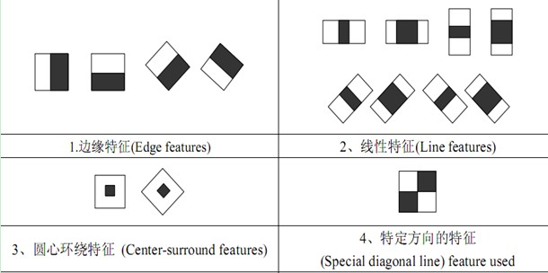
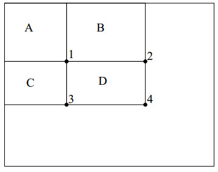
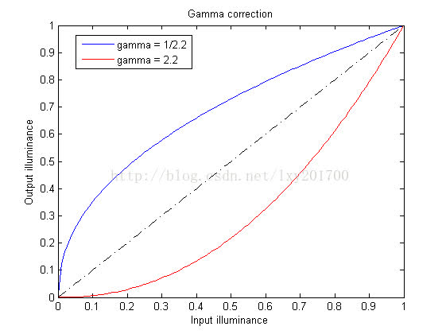
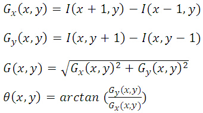
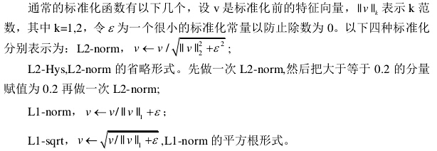

### opencv检测算法
#### 人脸检测算法: haar算法提取特征值+adaboost算法
1\. haar-like特征值反映图像的灰度变化情况, 有三类特征值: 线性特征 \ 边缘特征 \ 中心特征.
<left>

</left>
&ensp;&emsp;. 数据归一化: I(x,y)=(i(x,y)-u)/(cσ) u表示图像的均值, σ表示图像的标准差(σ^2=(1/N)*∑(x−μ)^2) 简化计算σ^2=(1/N)*∑(x^2−μ^2)
&ensp;&emsp;. 积分图定义: ii(x,y)=∑I(x′,y′) 其中x′≤x,y′≤y
&ensp;&emsp;. 递归代码求积分图: s(x,y)=s(x,y−1)+I(x,y) ii(x,y)=ii(x−1,y)+s(x,y), 初始值s(x,−1)=0,ii(−1,y)=0
&ensp;&emsp;. 矩形区域的积分图: rectsum(D)=ii(D)+ii(A)-(ii(B)+ii(C))
<left>

</left>
&ensp;&emsp;. 矩形窗口特征: 类别、大小和位置的变化，使得很小的检测窗口含有非常多的矩形特征, 通过AdaBoost算法来训练
2\. AdaBoost算法
#### [行人检测算法: hot算法提取特征值+svm算法](http://blog.csdn.net/hujingshuang/article/details/47337707/)
1\. 获取灰度图像,也就是图像的Y亮度信息
2\. 进行Gamma校正,目的提升或者降低亮度信息
&ensp;&emsp;. 数据归一化:  算法 I(x,y)=(i(x,y)+0.5)/256
&ensp;&emsp;. Gamma预补偿: 其中有平方根法\对数法等,例如: gamma=2.2, I(x,y)=I(x,y)^(1/gamma)
&ensp;&emsp;. 数据反归一化:算法 i(x,y)=I(x,y)*256-0.5
<left>

</left>
3\. 例如图像宽高216x304
&ensp;&emsp;. 分成8x8的cell(宽高有余数可以通过图片裁剪或者压缩去除), 得到27x38个cells.
&ensp;&emsp;. 把上下左右相邻的cell组成一个2x2的block, 得到26x37个blocks, 相邻block之间是有重叠的，这样有效的利用了相邻像素信息.
&ensp;&emsp;. cell单元hog处理:
&ensp;&emsp;&emsp;.. 求梯度以及梯度方向
<left>

</left>
&ensp;&emsp;&emsp;.. 求梯度方向的直方图,也就是特征向量
<left>

</left>
&ensp;&emsp;. 对每个block进行标准化, 每个cell含有9维特征向量, 一个block可以等到36维特征向量.
<left>

</left>
4\. svm算法
