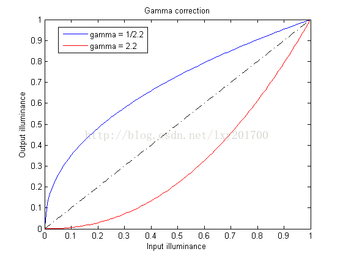

### opencv检测算法
* 人脸检测算法: haar算法提取特征值+adaboost算法
1\. 
* 行人检测算法: hot算法提取特征值+svm算法
1\. 获取灰度图像,也就是图像的Y亮度信息
2\. 进行Gamma校正,目的提升或者降低亮度信息
	* 数据归一化:  算法 I(x,y)=(i(x,y)+0.5)/256
	* Gamma预补偿: 其中有平方根法\对数法等,例如: gamma=2.2, I(x,y)=I(x,y)^(1/gamma)
	* 数据反归一化:算法 i(x,y)=I(x,y)*256-0.5
	<left class="half">
	{:height="50%" width="50%"}
	</left>
3\. 例如图像宽高216x304
	* 分成8x8的cell(宽高有余数可以通过图片裁剪或者压缩去除), 得到27x38个cells.
	* 把上下左右相邻的cell组成一个2x2的block, 得到26x37个blocks, 相邻block之间是有重叠的，这样有效的利用了相邻像素信息.
	* 对每个block进行标准化, 每个cell含有9维特征向量, 一个block可以等到36维特征向量.
	

