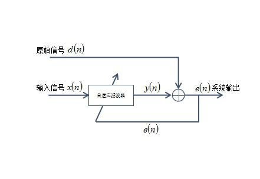
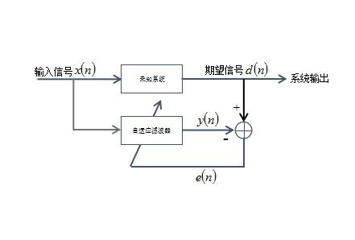
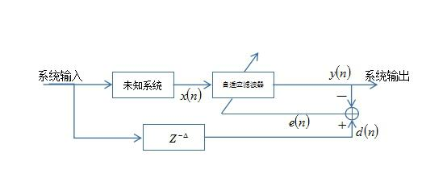
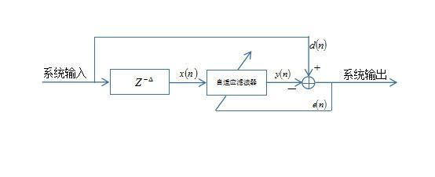

# 语音增强技术

## 滤波器法
* 陷滤波器
	* 系统函数: H(z) = (1 - z^-T)/(1 - b * z^-T)
* 自适应滤波器
	* LMS算法:
	* 输入信号: y[n] = s[n] + n[n] 
	* 参考信号: r'[n] = w(n]*r[n]
	* E[(y[k] - w[k]*r[k])^2] 最小

## 相关特征法
* 自相关处理抗噪法
	* y[n] = s[n] + n[n]
	* s[n] 与 n[n], n[n] 与 n[n] 互不相关
	* sum(s[n]*s[n-k] + s[n]*n[n-k] + s[n-k]*n[n] + n[n]*n[n-k]) / N
	* 自相关处理会产生二次谐波
	* y[n] -> y[n]^2 并且延迟一个周期(T 需要确定)
* 复数帧段主分量特征降噪法
	* 自相关矩阵 R (如何生成 R)
	* 计算R的特征值和特征向量
	* 对特征值大小排序,选择前P个特征值

## 非线性处理
	* 小波去噪法
		* 小波变换
		* 采用阈值处理,把小于阈值的值修改成0
	* 双变化去噪法
		* 乘性噪声和卷积噪声
		* fft -> ln -> ifft 变成加性噪声

## 减谱法
	* 利用语音"静音段",分别求出噪声和语音的功率谱
	* 纯语音的功率谱 = 语音功率谱 / (1 + exp(-w * (语音功率谱 - 噪声功率谱)))

## winner滤波器法
	* 原理
		* 利用原始基准的噪声信号,求解滤波器期望的最优解
		* d(t)为带噪声的信号输入信号,x(t)为噪声的基准信号
		* E{(d(t) - w*x(t))^2} 最小值,对w求偏导数为0,求得w = Rdx/Rxx, Rdx为d(t)与x(t)互相关函数,Rxx为x(t)自相关函数
	* 相关拓展
		* 噪声抑制
		
		* 未知系统辨识
		
		* 反演模拟
		
		* 预测
		
